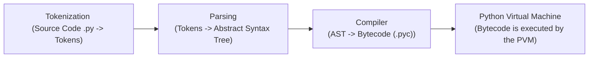

# python.exe
1. The python.exe file that we see is the python interpreter.
2. Technically python.exe is the entry point that launches the interpreter

> Your .py file is given as an argument to this python.exe.
> This python.exe is the CPython interpreter executable, compiled from the C Source code

# What all things does this interpret contain?
Note that this only happens for CPython - PyPy, JIT behave differently

> Note that python.exe is a compiled so it is in binary and machine friendly

## When is .py file converted to mahcine code?
1. Ideally in CPython contents of the .py file are never converted to machine code.
2. **Bytecode** is not **Machine Code**
3. **Bytecode** is only readable by the **PVM**
4. **PVM** reads the bytecode and runs the corresponding C code implemented in **python.exe**
5. As the bytecode is executed at runtime by an interpreter, rather than being compiled to machine code we say python is an interpreted language.